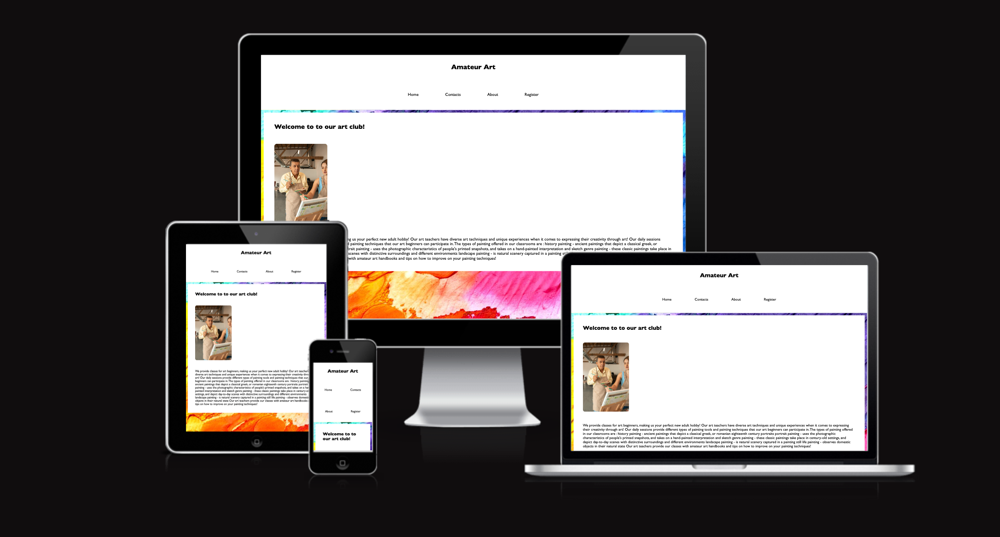
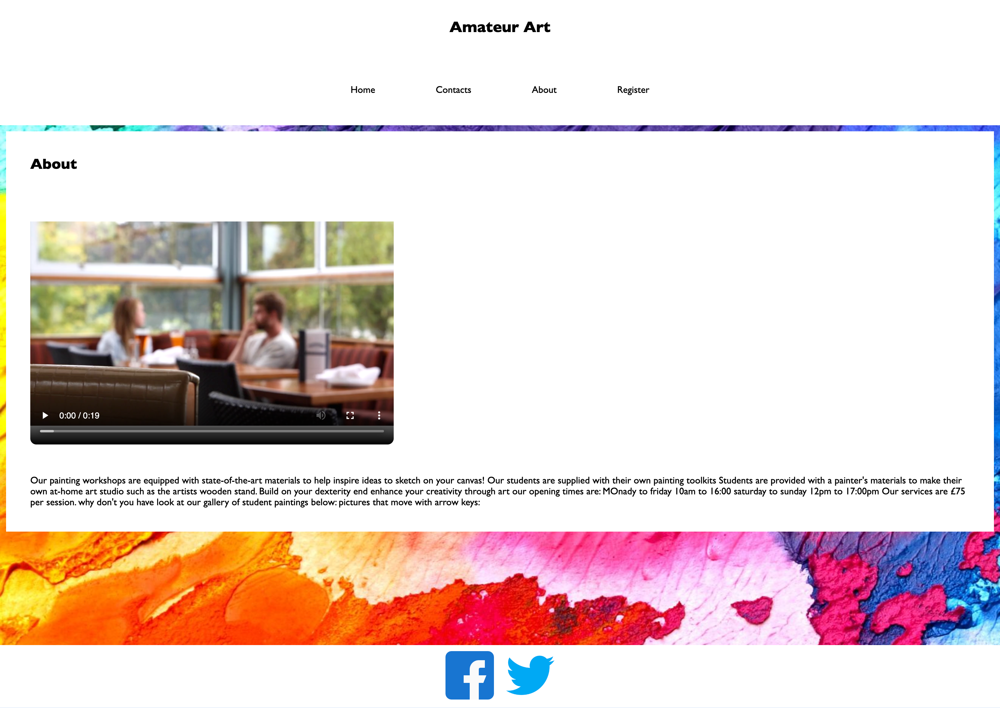

## Amateur Art
Welcome to my website amateur art!
It is an adult art club that features multiple sessions with art teachers!
It is a complemetary service to provide enjoyment and spark an inspiration in making art a hobby!

## Features

### Navigation Bar

The Navigation bar is featured on each page (home, contacts, about, and register). The navigation bar contains the logo for the website and the links to each individual page. The purpose of this feature is to allow the user to move between pages easily. 

### Footer Section

The footer section contains links to facebook and twitter. The purpose of this feature is to have the user follow the company (amateur art) on our social platforms and be informed on updates that could be relevant to them. 

### Background image
Each main section on every page includes a background image to match the tastes of the artful business. 

### Home Page

The homepage features text to welcome the user to the website. It also features a photograph to give the user an idea of a sample art class. Below the photograph, I have included a detailed description on the art class to describe the environment it fosters.

### Contacts Page

The contacts page includes information for the user to reach out to the company for art classes and to find the location of the company. The information displayed on the site is 
- Address
- Phone Number

### About Page

This page displays information about the business and give information that will inspire users to consider joining one of our workshop.

#### About Video
The about video is intended to feature a video of on of the art classes. Currently I am using a placeholder video for the purpose of this project.

### Register Page

This page will allow the user to submit their information in order to enquire about the art classes. This page includes a registration form that allows the user to specify their:

- First Name
- Last Name
- Email
- Number
- Availability for classes

The registration form includes a submit button to send their information to us. 

## Testing 

### Validator Testing 

- HTML
  - No errors were returned when passing through the official [W3C validator](https://validator.w3.org/nu/)
- CSS
  - No errors were found when passing through the official [(Jigsaw) validator](https://jigsaw.w3.org/css-validator/validator)
- Screen compatibility 
    - I have checked that the screen compatibility using the website, 'AM I RESPONSIVE?' [website](https://ui.dev/amiresponsive?url=https://8000-rawaspec-amateurart-n1twbn3zboq.ws-eu81.gitpod.io/home.html).
- Performance
    - The site performace was tested on lighthouse and received a score of 84.[website](https://googlechrome.github.io/lighthouse/viewer/?psiurl=https%3A%2F%2Frawa-spec.github.io%2Famateur_art%2F&strategy=mobile&category=performance&category=accessibility&category=best-practices&category=seo&category=pwa&utm_source=lh-chrome-ext). 

### Encountered Bugs (Fixed/Resolved)
There was a struggle with opening the broswer, as it showed error response multiple times. However, after some time, I discovered the issue was that was with my file naming that interfered with file path to open the browser.

## Deployment procedure

The application is deployed by configuring github to use the main branch for a github pages site.

## Credits

### Images
The images were found on [google](https://google.com) and pexels.com
- Background image: [google](https://google.com)
- Homepage section image: [pexels](https://www.pexels.com/photo/man-in-yellow-long-sleeve-shirt-holding-green-paintbrush-5757075/)
- Contacts section image: [pexels](https://www.pexels.com/photo/black-rotary-telephone-on-white-surface-1416530/)
- About section image: [pexels](https://pixabay.com/videos/restaurant-couple-bokeh-blur-6409/)
- Social Icons: [google](https://google.com)

